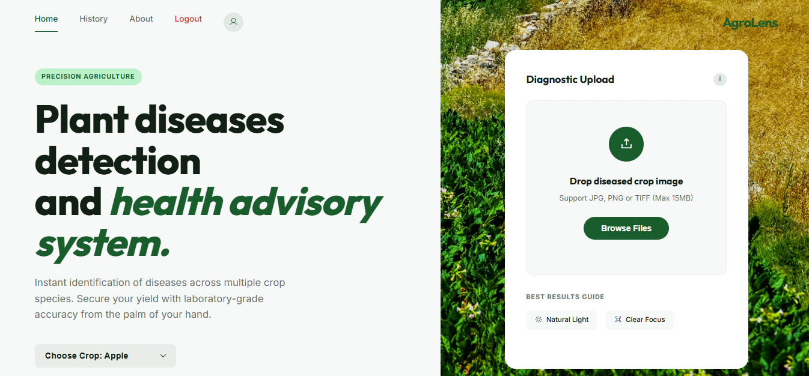
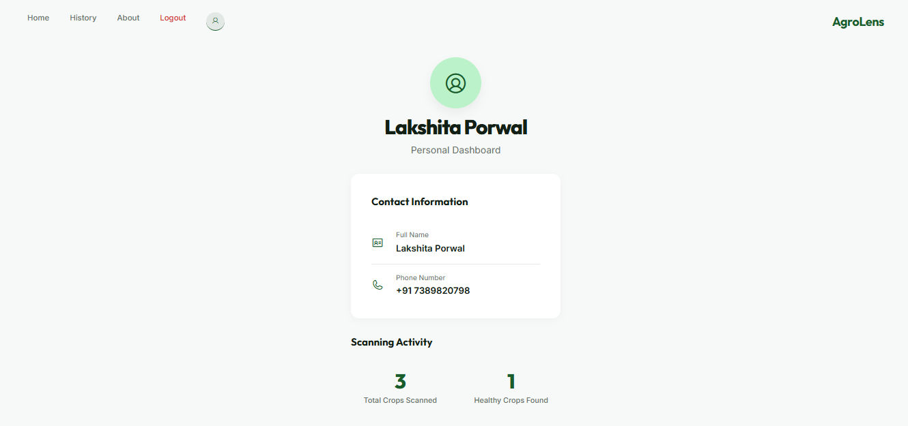
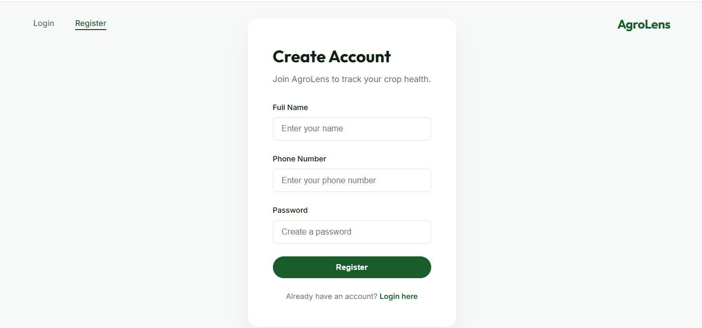
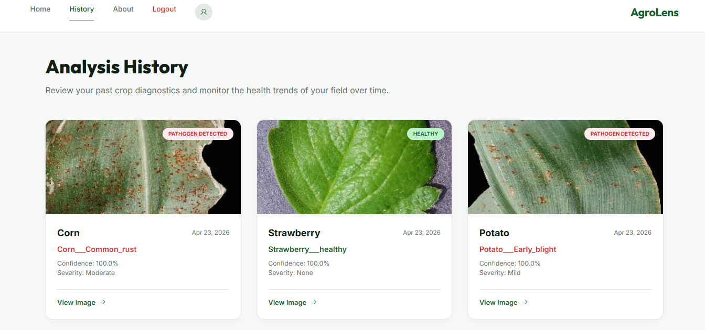
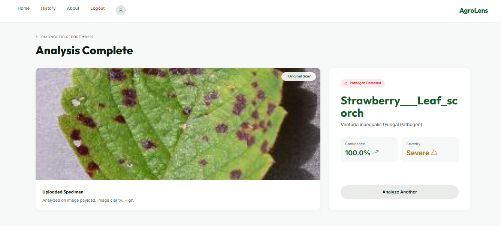

# Crop Disease Prediction System

An AI-powered web application that detects and classifies crop diseases from uploaded leaf images using Deep Learning and Computer Vision techniques.

---

# Project Overview

The Crop Disease Prediction System uses Convolutional Neural Networks (CNNs) trained on plant leaf datasets to classify diseases across multiple crops. Users can upload a leaf image and get instant predictions along with confidence scores through a web interface.

---

#  Technology Stack

## Frontend
- HTML
- CSS
- JavaScript

## Backend
- Python
- Flask

## Machine Learning
- TensorFlow
- Keras
- CNN (Convolutional Neural Network)

## Database
- MongoDB

## Tools
- VS Code
- GitHub
- Git LFS

---

#  Features

- User Authentication (Login / Register)
- Upload crop leaf images
- CNN-based disease prediction
- Multi-crop support
- Prediction confidence score
- Prediction history tracking
- Dashboard interface
- Responsive UI design

---

# 🌾 Supported Crops

- Apple
- Corn
- Potato
- Strawberry

---

#  Project Structure

```
Crop-Disease-Prediction/
│
├── models/
├── static/
├── templates/
├── screenshots/
│   ├── home.png
│   ├── dashboard.png
│   ├── login.png
│   ├── register.png
│   ├── history.png
│   └── result.png
│
├── app.py
├── requirements.txt
└── README.md
```

---

#  Installation & Setup

## 1. Clone Repository
```bash
git clone https://github.com/lakshitaporwal28/Crop-Disease-Prediction-.git
```

## 2. Move to Project Directory
```bash
cd Crop-Disease-Prediction-
```

## 3. Install Dependencies
```bash
pip install -r requirements.txt
```

## 4. Install Git LFS
https://git-lfs.com

```bash
git lfs install
```

## 5. Run Application
```bash
python app.py
```

## 6. Open in Browser
```
http://127.0.0.1:5000
```

---

#  Project Screenshots

##  Home Page


## Dashboard


##  Login Page


##  Register Page


##  History Page


##  Prediction Result


---

#  Team Members

- Lakshita Porwal
- Labdhi Vohra
- Lakshita Patel

---

#  Future Improvements
- Add fertilizer suggestion 
- Add more crop types
- Improve model accuracy
- Deploy on cloud (AWS / Render)
- Real-time detection
- Mobile optimization

---

#  Repository

https://github.com/lakshitaporwal28/Crop-Disease-Prediction-.git
